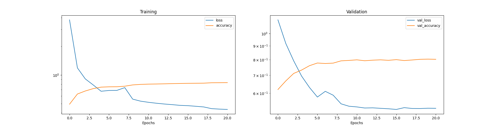

# g2net Hackathon in Malta

My attempt at g2net's hackathon in Malta 2020.

## Results
The results are shown on the submission dataset.

|Metric|Score|
|:------:|:-------|
| Precission | 79.5 % |  
| Recall | 79.6 % |
| F1-score | 79.5 % |
| Balanced accuracy | 79.6 % |

## Information on the Hackathon

The data used for the challenge contains earthquakes, together with non-earthquake ambient noise. The goal of this challenge is to correctly classify an unknown set of data `df_submission.pkl.gzip` using any model that was trained on `df_train.pkl.gzip` and `df_test.pkl.gzip` where the correct labels are provided. 

## Files

`network.py` - Neural network model

`optimization.py` - Hyperparameter optimization

`Adaboost.py` - Adaboost model

`evaluate.py` - Evaluates the models

`submission.py` - Creates submission files

`MachneLearningUtils.py` - Utility functions for machine learning

## Confusion matrix plot for the neural network model

## Loss plot for the neural network model

## Information on the data and the hackathon

The tutorial for the hackathon is [here](https://github.com/zerafachris/g2net_malta_hackaton)

The full set of notebooks and tutorials can be found [here](https://github.com/zerafachris/g2net_2nd_training_school_malta_mar_2020)

You need to download the training, testing and submission datasets from [kaggle](https://www.kaggle.com/datasets/zerafachris/g2net-training-school-hackaton)

To evaluate the model you can get the true submission labels [here](https://github.com/zerafachris/g2net_2nd_training_school_malta_mar_2020/blob/master/HACK_leader_board/Metric_Calculation/data/submissions_true.csv)

